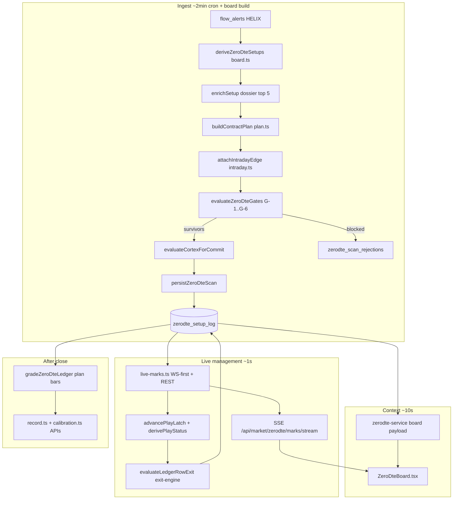

# 0DTE Command — deep system audit (architecture, losers, roadmap)

**Date:** 2026-07-18 · **Branch:** `cursor/zerodte-deep-audit-261c` (docs-only PR)  
**Audience:** product + engineering — “why mostly big losers?” and “what to build next”  
**Builds on:** `NIGHTHAWK-0DTE-DECISION.md`, `0DTE-BREAKTHROUGH-LEDGER.md`, `ZERODTE-DATA-PATH-AUDIT.md`, `NIGHTHAWK-CORTEX-DESIGN.md`, `NIGHTHAWK-VS-SLAYER-0DTE.md`  
**Code snapshot:** `main` @ 2026-07-18 (implementation PR **#786** is separate — live UI + 1s lane fixes)

---

## 0. Executive summary

### Is the architecture correct?

**Yes at the skeleton, no at the commit discipline.**

The end-to-end shape is right for a production 0DTE desk:

1. **Ingest** flow tape → **score** evidence → **hard gates** → **Cortex precision** → **one-way commit** to ledger  
2. **Live marks lane** (~1s) for open plays, **board** (~10s) for context  
3. **Exit engine** (ratchet / thesis / flat / plan rules) + **public grading**

That matches how a serious desk should work: cheap safety floor, expensive precision layer, honest ledger, fast marks for management.

What went wrong in live sessions (especially 7/13-style days) is **not** “we should WebSocket harder.” It is:

- **0DTE Command was built first as a flow detector**, then gates were bolted on. Several **UI SKIP rules never became persist blocks**.  
- **Payoff math** (−50% stop / +100% trim) needs **~33% WR to break even**; calibration shows large volume in **55–64 and counter-tape** bands that sit **below or at breakeven**.  
- **Precision layer (Cortex) abstains** when sources time out → commits on gates alone.  
- **Exit rules** still allow **slow bleeds to full −50%** unless +25% ratchet arms first.

**Realistic target (from decision doc, still valid):** not “100% winners” — **precision mode: fewer prints, 55–65% WR on asymmetric payoff, losses capped, every play graded in public.**

On 7/13 forensics, gates G-1..G-7 **as specified** would have removed **5 of 7 losers** before entry. Several of those gates are **shipped (G-1..G-6)**; **G-7 and plan-quality blocks are not fully wired at persist time.**

---

## 1. End-to-end architecture (what exists today)



### Core module map

| Concern | Module(s) | Role |
|--------|-----------|------|
| Orchestration | `src/lib/zerodte/scan.ts` | Scan, persist, sync, grade |
| Evidence | `src/lib/zerodte/board.ts` | Setup derivation, enrichment, audit row |
| Hard gates | `src/lib/zerodte/gates.ts`, `governor.ts` | G-1..G-6, session caps |
| Precision | `src/lib/zerodte/cortex-gate.ts`, `src/lib/nighthawk/cortex/*` | Veto / net-negative / abstain |
| Plan | `src/lib/zerodte/plan.ts` | Entry band, −50/+100, time stop, grading |
| Exits | `src/lib/zerodte/exit-engine.ts`, `exit-sync.ts` | Ratchet, thesis, flat timeout |
| Live quotes | `src/lib/zerodte/live-marks.ts`, `src/lib/ws/options-socket.ts` | ~1s marks, cap 16 OCCs |
| Trader copy | `src/lib/zerodte/intel.ts` | ADD/HOLD/TRIM/SELL (deterministic) |
| UI | `src/features/nighthawk/components/ZeroDteBoard.tsx` | Board + briefing surfaces |
| Accountability | `record.ts`, `calibration.ts`, `skip-grading.ts` | Public WR, gate graduation |

### Verdict by layer

| Layer | Correct? | Notes |
|-------|------------|-------|
| **Data fan-in (server WS + REST)** | ✅ | Leader-elected upstream WS; browser SSE — appropriate |
| **Scan cadence (~2 min)** | ✅ | Fine for *finding*; not for *managing* (marks lane handles that) |
| **Gate stack G-1..G-6** | ✅ mostly | Shipped; calibration mode on G-4/G-6 |
| **Cortex on survivors** | ⚠️ | ABSTAIN passes; thin evidence floor 0.5 is low |
| **Persist one-way door** | ⚠️ | Only checks `gate.verdict === "COMMIT"` — see §3 |
| **Live marks B-9** | ✅ | WS-first; fixed P0 staleness class |
| **Exit engine B-8** | ⚠️ | Good rules; 45m flat timeout long for 0DTE; thesis needs Cortex |
| **UI honesty** | ⚠️ | SKIP cards ≠ commit rules for MOVED/illiquid |
| **Track record** | ✅ | Honest methodology; use it to tighten gates |

---

## 2. Why you saw “mostly big losers” — root causes (evidence-backed)

Payoff reminder: **−50% stop / +100% trim → breakeven WR = 33.3%.** Every committed loser that hits the **full stop** is a **−50% premium** print — visually “big.”

### 2.1 Entry-side killers (before the trade is “yours”)

| # | Mechanism | Evidence | Still happening? |
|---|-----------|----------|------------------|
| **E1** | **Counter-tape longs on red days** | F-3: 7/13 longs 0/5 avg −54.7% | **Mitigated** by G-1 tape alignment — if SPY bias readable |
| **E2** | **Score 55–64 band** | F-2: 18.8% WR (n=16) | **Mitigated** by G-3 floor 65 — tail above 65 still thin |
| **E3** | **9:45–11:00 weak window** | F-4: 36.8% WR (n=19) | **Still open** — only −5 score + tier demotion |
| **E4** | **Chasing moved premium** | `plan.ts` `CHASE_PCT=35` → `MOVED`; UI SKIP via `resolveFreshFindStatus` | **BUG CLASS:** `persistZeroDteScan` only checks gate — **does not block MOVED/illiquid/NO_QUOTE** (`scan.ts` ~463–465) |
| **E5** | **Cortex abstain / thin pass** | `cortex-gate.ts`: all sources absent → ABSTAIN commits | **Yes** — by design; measure cost in calibration |
| **E6** | **VIX ≥17 with score 75+ aligned** | F-1: 25% WR VIX 17–20 vs 69% below 17 | **Partial** — G-4 raises bar, does not block all |
| **E7** | **Intraday conflict not gated** | `intraday_conflict` set in scan, logged in audit — **not in `evaluateZeroDteGates`** | **Yes** |
| **E8** | **G-7 macro windows missing** | Spec in decision doc; SPX has `macroHardBlock` in `spx-play-gates.ts` — **not shared with 0DTE** | **Yes** |
| **E9** | **Top score / A+ inversion** | F-5: crowded late flow scores highest | **Display capped** (`conviction.ts`); **commit not blocked** at 85+ |
| **E10** | **Illiquid spreads** | `illiquid` → UI SKIP only | **Same as E4** — can commit if gates pass |

**Highest-impact fix for “stop printing losers we can already see”:** **E4 + E7 + E8** — enforce at **persist** what the UI already tells the trader.

### 2.2 Management-side killers (after commit)

| # | Mechanism | Evidence |
|---|-----------|----------|
| **M1** | **Full −50% before ratchet arms** | Need +25% peak to arm breakeven floor (`exit-engine.ts`) |
| **M2** | **45 min flat timeout** | Theta bleed on 0DTE — 7/13 losers were slow bleeds (B-1 ledger) |
| **M3** | **Thesis exit needs ≥2 opposes or veto** | Single contrary reading does not exit |
| **M4** | **Thesis skipped when Cortex null** | `evaluateLedgerRowExit` — no evidence → thesis check skipped |
| **M5** | **Governor halt counts plan stops only** | Ratchet/thesis exits may not increment stop budget (`scan.ts` ~733–736) |
| **M6** | **No auto-execution** | Engine persists CLOSED; member must act — discipline gap if ignored |
| **M7** | **Marks lag (pre-B-9)** | Fixed by live-marks lane; ensure prod options WS healthy |

### 2.3 Scoring / “conviction” confusion

The **evidence score** (0–100 on flow tiers) is **not** the same as **edge**:

- Rewards **gross premium, sweeps, dominance** — often **late, crowded** flow  
- Dossier + Cortex add precision but **abstain/thin** paths weaken it  
- **Merit tier A/B/C** affects display and suggested size chips — **not commit** (except via score in G-3)

**Design principle for “winners only”:** treat **commit** as a **portfolio action**, not a **feed ranking**. The feed can show 20 interesting tapes; the ledger should print **0–3** per session.

---

## 3. Critical architecture gaps (display vs commit)

These are **inconsistencies**, not missing features:

```text
UI says SKIP          persistZeroDteScan says COMMIT if gate.verdict === COMMIT
─────────────────────────────────────────────────────────────────────────────
MOVED (chase)         ❌ not checked at persist
illiquid spread       ❌ not checked at persist
NO_QUOTE plan         ❌ not checked at persist (sometimes no OCC anyway)
intraday_conflict     ❌ flag only — not G-7..G-8 block
earnings / halted     ❌ on payload — not hard block
resolveFreshFindStatus WATCH/SKIP — never OPEN until ledger (✅ correct UX)
```

**Recommended new hard gates (persist-enforced):**

| Gate | Rule | Code touch |
|------|------|------------|
| **G-8** | `plan.entry_status === "IN_RANGE" \|\| "CHEAPER"` only | `persistZeroDteScan` or `evaluateZeroDteGates` |
| **G-9** | `!plan.illiquid` | same |
| **G-10** | `!intraday_conflict` | `gates.ts` |
| **G-7** | Shared `macroHardBlock()` from `spx-play-gates.ts` | new `src/lib/macro-event-windows.ts` |
| **G-11** | `!halted && !(earnings today for ticker)` | `gates.ts` + `earnings.ts` |

Until these exist, **members can see SKIP on a card while a parallel code path commits** if gate timing flaps between ticks.

---

## 4. Design system & trader experience

### What works

- **Two-speed UI** (fast marks, slow context) — correct mental model  
- **Governor strip** (open n/3, stops, halt, re-entry lock) — Slayer-grade discipline visible  
- **Gate SKIP cards** with **all** block reasons listed  
- **Pinned entry premium** + staleness dimming on marks (B-9)  
- **Briefing deck** (Overview / Scoring / Hawk Intel) — separates *story* from *numbers*  
- **Intel verbs** (`buildIntelNote`) — actionable copy from live distances  

### What misleads

| UI element | Trader belief | Reality |
|------------|---------------|---------|
| High evidence score | “A+ setup” | May be late crowded flow (F-5) |
| WATCH card | “Not in yet” | Correct — but MOVED can still commit (§3) |
| TRIM badge | “Take profit” | Status latch — **no broker execution** |
| Cortex summary on card | “AI approved” | May be **ABSTAIN** with no evidence |
| Suggested 0.5× size | “System sized me” | **Suggestion only** — not enforced |
| Dealer `gamma_regime` label | “Live greeks” | **Scan-time positioning** — not contract Δ/Γ |

### Design system recommendations

1. **Commit readiness badge** — green / amber / red from B-7 “readiness light” (all veto sources fresh, bias readable, marks lane healthy).  
2. **Show `entry_status` + `gate.verdict` + `cortex.decision` on every committed row** — no silent abstain.  
3. **Separate “Scanner feed” from “Committed ledger”** visually — precision mode should feel **empty most days**.  
4. **Counterfactual on SKIP** — “Blocked by G-1; similar setups: 12% WR (n=40)” from calibration API.

---

## 5. Data plane & APIs

### What you already use

| Source | 0DTE use | Transport |
|--------|----------|-----------|
| HELIX `flow_alerts` | Setup derivation | Postgres (ingest) |
| UW WS | Tape, tide, prints, GEX channels | Server WS (`uw-socket.ts`) |
| Polygon/Massive REST | Chain snapshot, minute bars, VIX | Rate-limited funnel |
| Polygon/Massive options WS | Live Q quotes (when enabled) | Leader-elected WS |
| BIE / Cortex readers | 8 evidence sources | Parallel fetch, 2.5s budgets |
| SPX desk / NH edition | G-6 cross conflict | Postgres + BIE |

### Staleness / failure behavior

- **Unreadable SPY bias** → G-1 fail-closed (good)  
- **Cortex all absent** → ABSTAIN commit (precision off — **measure**)  
- **Snapshot 2.5s timeout on scan** → no plan / stale sync (open plays use marks lane)  
- **UW ~2 RPS** → enrichment throttled; WS reduces REST for tape  

### APIs to add (recommended)

| API / surface | Purpose | Priority |
|---------------|---------|----------|
| **`GET /api/market/zerodte/readiness`** | Engine readiness (bias age, cortex source freshness, marks lane, governor) | P0 |
| **`GET /api/market/zerodte/commit-preview?ticker=`** | Exact gate + plan + cortex verdict **before** commit (debug + UI) | P1 |
| **Extend `calibration`** with **live session dashboard** | WR by gate block, abstain cost, MOVED-would-have-saved | P1 |
| **Polygon LULD + halts** (already opt-in for SPX) | Hard block single-name 0DTE into halt | P2 |
| **UW `greek-exposure` / strike flow** (REST) | Cortex source hardening — not member greeks panel | P2 |
| **Massive tick-level trades** | Confirm “at the ask” aggression on commit tick | P3 |

### APIs you do **not** need (yet)

- **Browser-direct Polygon/UW WebSocket** — keys, connection limits, proxy issues  
- **Sub-second full board refresh** — expensive; marks lane is the right cut  
- **LLM on the money path** — rejected in breakthrough ledger (B-wave)  
- **Playbook FSM on 0DTE** — 0 closed OOS trades on home surface; port only after evidence  

---

## 6. Exit & payoff system — is it strong enough?

### Current rules (`plan.ts` + `exit-engine.ts`)

- Stop **−50%**, target **+100%**, time **15:30 ET**, no new entries after **15:00 ET**  
- Ratchet: +25% → breakeven; +50% → +20% floor; post-TRIM runner +50% floor  
- Thesis: veto or 2+ weighted opposes  
- Flat: 45 min inside ±10%, peak < +10%  

### Debate: tighten for “winners only”?

| Change | Pro | Con | Verdict |
|--------|-----|-----|---------|
| Raise score floor **65 → 70** | Calibration 65–74 only ~50% WR | Fewer prints | **CALIBRATE-FIRST** — use 30 sessions |
| Shorten flat timeout **45 → 20 min** | Cuts bleed class | More scratched winners | **BUILD** — counterfactual in skip/exit grader |
| Arm ratchet at **+15%** not +25% | Earlier green protection | More noise exits | **CALIBRATE-FIRST** |
| Tighter stop **−35%** | Smaller losers | Breaks published plan / WR math | **REJECT** until plan version bump |
| Enforce **0.5× size** on VIX≥17 | F-1 alignment | Product/execution | **BUILD** (ledger flag, not just chip) |
| **G-2 extend to 10:30** | F-4 opening weakness | User wanted 9:45 open | **MEASURE** via `gate_calibration_json` |

**Payoff math cannot change without member communication:** −50/+100 is baked into grading, intel copy, and track record methodology.

---

## 7. “Winners only” roadmap (phased)

### Phase A — Stop obvious losers (code, 1–2 PRs after this doc)

**Goal:** Align **persist** with **UI SKIP** and close spec holes.

1. **G-8/G-9:** Block MOVED + illiquid + NO_QUOTE at `persistZeroDteScan`  
2. **G-10:** `intraday_conflict` → hard block in `gates.ts`  
3. **G-7:** Extract `macroHardBlock` to shared module; wire 0DTE gates  
4. **Persist `cortex.abstained` on row UI** — amber “precision layer offline”  
5. Merge **#786** (1s status + exit on marks tick + UI polish)

**Success metric:** Rejection log grows; commits/session ↓; blocked counterfactual WR ≪ committed WR.

### Phase B — Exit strength (1 PR)

1. Run **full exit engine on 1s lane** (started in #786 — verify in prod)  
2. Shorten **flat timeout** with grader shadow (20 vs 45 min)  
3. Governor counts **all protective exits** toward halt budget  
4. **B-7 readiness light** on board header  

**Success metric:** Avg loss on losers ↓; fewer −50% full stops; expectancy ↑.

### Phase C — Calibration loop drives thresholds (ongoing)

1. Weekly auto-report (B-6) from `calibration.ts` + skip grading  
2. Graduate G-4/G-6 from calibration JSON when n≥10 and delta≥15 pts  
3. **Score floor** and **opening window** adjustments **data-only** — no gut calls  
4. A+ display unlock already exists — tie **commit size suggestion** to same buckets  

**Success metric:** 55–65% WR on committed rows over rolling 30 sessions; PF > 1.2 on premium plan grades.

### Phase D — Optional edge (only if Phase A–C plateau)

- Session archetype classifier (B-5)  
- Opening harvest Cortex source (B-2)  
- Live contract greeks panel (product call — not required for WR)  
- Playbook FSM port (only after playbook has ≥30 sessions closed trades)

---

## 8. What to remove or stop doing

| Remove / stop | Why |
|---------------|-----|
| Treating **high flow score** as commit signal | Inverted at top of band (F-5) |
| **Silent Cortex abstain** commits without UI flag | Hides precision outage |
| **Committing on refresh tick** without re-checking plan status | Chase race |
| **Expecting 100% WR** | Drives bad grading or no prints |
| **Duplicating REST marks** when options WS healthy | Rate limit + lag |
| **New APIs for member greeks** before commit discipline fixed | Wrong priority |

---

## 9. Relationship to open PRs

| PR | Scope | This audit |
|----|-------|------------|
| **#786** | UI polish + 1s status + exit on marks tick + dev sim | **Implement** Phase A UX + part of Phase B |
| **#782 / #784** | Superseded by #786 | Close when #786 merges |
| **This PR** | Analysis + roadmap only | **No runtime changes** |

---

## 10. Immediate action list (for review)

If you approve direction, implement in **separate code PRs** (not this doc):

| Priority | Item | Est. invasiveness |
|----------|------|-------------------|
| **P0** | G-8/G-9 persist blocks (MOVED, illiquid) | Small — `scan.ts` + tests |
| **P0** | G-10 intraday conflict gate | Small — `gates.ts` |
| **P0** | Prod `OPTIONS_WS_ENABLED` validation | Ops |
| **P1** | G-7 shared macro module | Medium — extract from SPX |
| **P1** | Readiness API + board amber state | Medium |
| **P1** | Cortex abstain visible on committed rows | Small UI |
| **P2** | Flat timeout 45→20 with shadow grader | Medium |
| **P2** | Enforced half-size flag on ledger (VIX band) | Medium |

---

## 11. How to validate (repro)

```bash
# Logic / integration audits (existing)
npm run validate:zerodte-logic   # if scripted — else:
node scripts/zerodte-logic-audit.mjs
node scripts/zerodte-integration-audit.mjs

# Unit tests (gates, cortex, exits, marks)
npm test -- src/lib/zerodte/

# Calibration / record (staging or prod with auth)
GET /api/market/zerodte/calibration
GET /api/market/zerodte/record

# 7/13 replay fixtures
src/lib/zerodte/gates-replay-2026-07-13.test.ts
```

---

## 12. Bottom line

- **Architecture:** Server-side WS → 1s marks → SSE → ~10s board is **correct**. Do not rebuild around browser WebSockets.  
- **Losses:** Mostly **entry discipline holes** (chase, weak bands, abstain, missing macro/conflict gates) + **−50% payoff** on wrong-way 0DTE, not “slow UI.”  
- **Stronger system:** **Fewer commits**, **persist = UI**, **faster honest exits**, **calibration loop owns thresholds** — not more scanners or more API firehose.  
- **100% winners:** Not honest. **Precision-first 55–65% WR** with capped losses **is** honest and achievable if Phase A gates ship.

---

*Living doc — append deltas to `docs/audit/FINDINGS.md` when code ships.*
